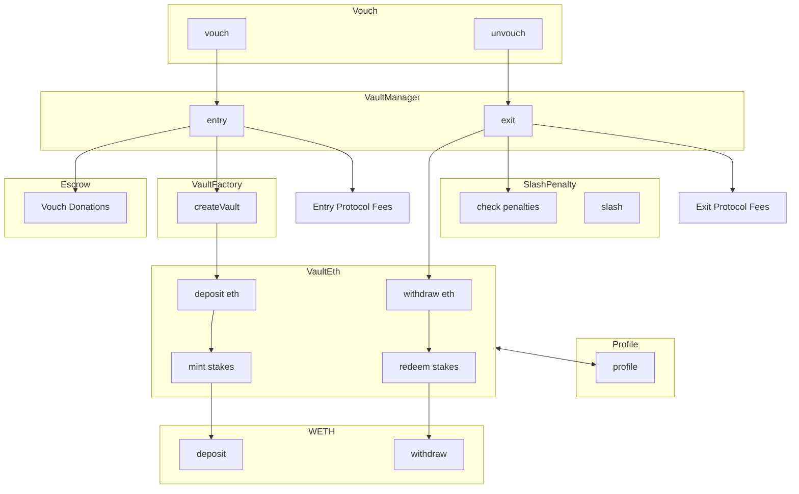
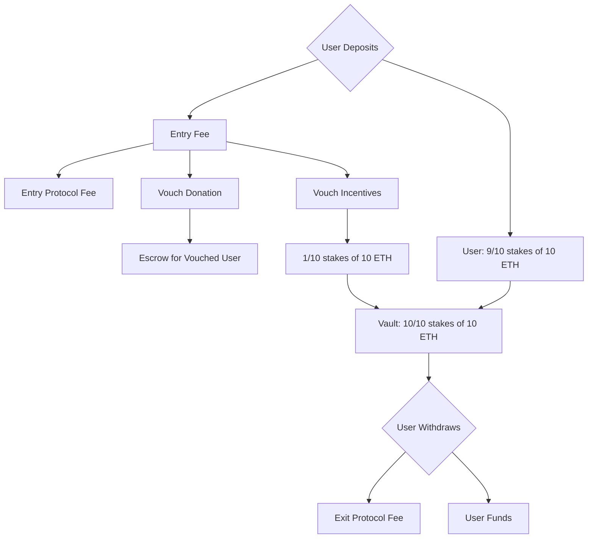

# Ethos Vault System Diagram

Currently only displaying vault system for ETH vaults.
ERC20 token based vaults are not yet supported.

# Ethos Vault Fee Structure

## Fee Types

1. **Entry Fee**: Applied when a user deposits funds into a vault.
2. **Exit Fee**: Applied when a user withdraws funds from a vault.
3. **Vouch Donation**: A portion of the entry fee that goes to the person being vouched for, held in an escrow contract.
4. **Vouch Incentives**: Rewards for users who vouch for someone early.

## Fee Flow & Terms

## Fee Application

1. When a user deposits funds, the entry fee is deducted first.
2. The entry fee is split into entry protocol fee, vouch donation, and vouch incentives.
3. The entry protocol fee is sent to Ethos fee receiver address.
4. The vouch donation is sent to the EthosEscrow contract on behalf of the vouched user.
The vouched user can withdraw their donations from the EthosEscrow contract at any time.
5. The remaining amount is deposited into the vault.
6. Vouch incentives are allocated to existing vouch holders in the vault.
7. When a user withdraws, the exit fee is applied to the withdrawal amount.

## Important Notes

1. Fees are calculated in basis points (1 basis point = 0.01%).
2. The first voucher for a user doesn't incur vouch incentives fees.
3. All fees are configurable by the admin through the EthosVaultManager contract.

## Examples

### Alice vouches Bob

Alice wants to vouch for Bob with 1000 ETH. Fees applied:

* Entry Protocol Fee (1%): 10 ETH
* Vouch Donation to Bob (2%): 20 ETH
* Vouch Incentives (3%): 0 ETH
  * Alice doesn't pay incentives because she is the first voucher for Bob.
* Total fees deducted from Alice's deposit: 30 ETH

Where the ETH goes:

* Amount deposited into Bob's vault: 970 ETH
* Amount deposited into Bob's escrow: 20 ETH
* Amount deposited into Ethos fee receiver: 10 ETH

Underneath the hood, the Vault now shows:

* Alice holds 970 of 970 stakes of 970 ETH

### Cat vouches Bob

Later, Cat wants to vouch for Bob with 1000 ETH. Fees applied:

* Entry Protocol Fee (1%): 10 ETH
* Vouch Donation to Bob (2%): 20 ETH
* Vouch Incentives (3%): 30 ETH
* Total fees deducted from Cat's deposit: 60 ETH

Where the ETH goes:

* Amount deposited into Bob's vault: 970 ETH
* Amount deposited into Bob's escrow: 20 ETH
* Amount deposited into Ethos fee receiver: 10 ETH

Underneath the hood, the Vault now shows:

* Alice holds 970 of 1910 stakes of 1940 ETH (worth 985.2 ETH)
  * Alice has gained 15.2 ETH, or 1.52% of Cat's deposit
* Cat holds 940 of 1910 stakes of 1940 ETH (worth 954.8 ETH)
  * Cat has not paid a full 3% in vouch incentives; she's essentially split them between Alice and herself.

## Alice unvouches Bob

Later, when Alice wants to unvouch and withdraw ETH:

* She has 985.2 ETH in her vault
* Exit Protocol Fee (1%): 9.85 ETH
* Amount Alice receives: 975.35 ETH
